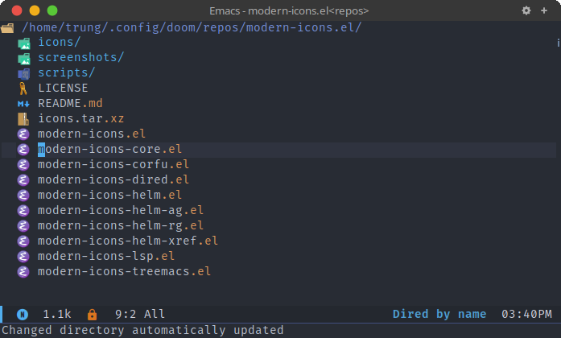

<div align="center">

# modern-icons-dired.el

Modern icons for Emacs [dired-mode](https://www.gnu.org/software/emacs/manual/html_node/emacs/Dired.html).

</div>

This library integrates [modern-icons.el](https://github.com/taquangtrung/modern-icons.el) to display modern and pretty SVG icons for [dired-mode](https://www.gnu.org/software/emacs/manual/html_node/emacs/Dired.html) files and directories in Emacs.

## Installation

Install from Melpa (supported soon) or manually using [straight.el](https://github.com/radian-software/straight.el) like below:

```elisp
(use-package modern-icons
  :straight (modern-icons :type git :host github
                          :repo "taquangtrung/modern-icons-dired.el"))
```

## Usage

Include the following code into your configuration file:

```elisp
(require 'modern-icons-dired)
(modern-icons-dired-enable)
```

## Screenshots

  <p align="center">
    
  </p>

## Acknowledgements

This library is inspired by [nerd-icons-dired](https://github.com/rainstormstudio/nerd-icons-dired).
